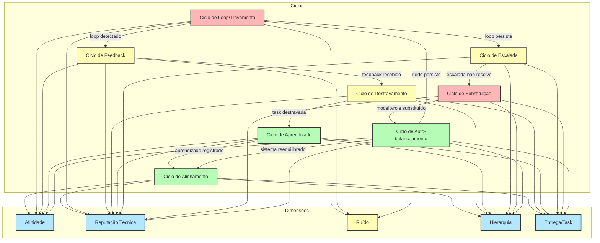

# 📈 Diagrama de Ciclos e Dimensões — Slice/ALIVE

Este arquivo documenta todos os ciclos possíveis do fluxo Slice/ALIVE em relação às principais dimensões colaborativas: afinidade, reputação técnica, ruído, hierarquia e entrega.

---

## 🟦 Diagrama Mermaid

---

## 🟩 Legenda
- **Azul:** Dimensões principais do fluxo.
- **Verde:** Ciclos positivos (alinhamento, aprendizado, auto-balanceamento).
- **Amarelo:** Ciclos de alerta (feedback, destravamento, escalada).
- **Vermelho:** Ciclos críticos (loop, substituição).

## 📝 Explicação
Cada ciclo impacta diferentes dimensões do fluxo Slice/ALIVE. O sistema é desenhado para retroalimentar, aprender e se auto-balancear, garantindo evolução contínua, destravamento rápido e registro auditável de todos os eventos colaborativos.
