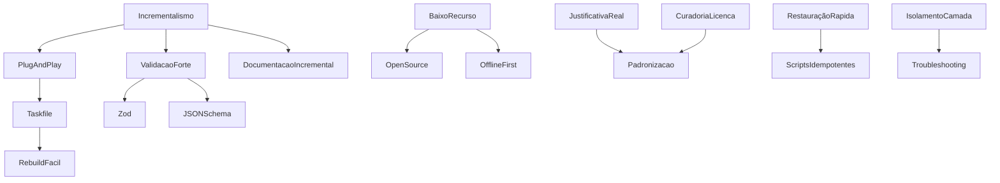

# CONCEPTS.md — Princípios Fundamentais do Ecossistema

# PRÉ-CONCEITO: Processamento Incremental de Conceitos no Slice/ALIVE

**Objetivo:**
Definir como os conceitos devem ser pensados, organizados e evoluídos antes de serem formalmente documentados, garantindo clareza, adaptabilidade e contexto reidratado.

**Etapas do pré-processamento incremental:**
1. **Identificação:**
   - Levantar possíveis conceitos fundamentais e auxiliares.
   - Sinalizar dependências e relações entre eles.

2. **Pré-conceitualização:**
   - Esboçar cada conceito em poucas linhas, focando no propósito e impacto.
   - Identificar onde a redundância pode ser útil para reidratar contexto.

3. **Organização inicial:**
   - Ordenar os conceitos de acordo com dependências lógicas e onboarding.
   - Marcar pontos onde a redundância será intencional (ex: início de seções, resumos, exemplos).

4. **Validação incremental:**
   - Validar cada pré-conceito com o time (ou IA), ajustando ordem, conteúdo e redundância conforme feedback.

5. **Evolução contínua:**
   - Permitir revisões rápidas e incrementais, registrando aprendizados e memes no processo.
   - Redundância é revisitada: se começa a gerar ruído, é ajustada; se reforça contexto, é mantida.

**Exemplo de aplicação:**
Antes de documentar "Incrementalismo", faço um esboço, vejo se depende de "Validação Contínua", marco onde repetir a definição ajuda, e só então formalizo no CONCEPTS.md.

---

# Incrementalismo e Validação Contínua 🟦

**Definição objetiva:**
O ecossistema Slice/ALIVE evolui sempre em pequenos passos incrementais, validando cada etapa antes de avançar. Nenhuma decisão, automação ou documentação é consolidada sem validação prática e feedback real.

**Origem/contexto:**
Inspirado em engenharia industrial, automação e metodologias ágeis, esse conceito garante robustez, aprendizado contínuo e evita decisões precipitadas ou retrabalho.

**Critérios de decisão:**
- Sempre que possível, quebre tarefas, decisões e documentações em etapas pequenas e validadas.
- Só avance para o próximo passo após validação objetiva (testes, feedback, revisão).
- Se houver dúvida, volte um passo e revalide.
- Não existe "grande salto" no Slice/ALIVE: tudo é incremental, reversível e rastreável.

**Exemplo prático:**
Ao criar um novo módulo, documente e valide cada função antes de integrar ao todo. Se um bug surgir, corrija e valide localmente antes de propagar para o restante do sistema.

**Memes/analogias:**
- "Cagar" é um processo incremental: só avança depois de limpar e validar. (Meme clássico do Slice)
- "Se der ruim, volta um passo, aprende e segue."

**Emoji sugerido:**
🟦 (valor agregado, clareza cristalina)

**Relação com outros conceitos:**
- Base para Plug-and-Play, Validação Forte, Documentação Incremental e Memória Coletiva.
- Garante que Redundância Consciente seja aplicada só quando agrega valor.

---

## Exemplos Práticos para Cada Conceito

### Incrementalismo e Validação Contínua
- Exemplo: Ao criar um novo módulo, documente e valide cada função antes de integrar ao todo. Se um bug surgir, corrija e valide localmente antes de propagar para o restante do sistema.

### Baixo Recurso & Custo Mínimo
- Exemplo: Antes de adicionar uma dependência, verifique se ela é open source, se roda offline e se não exige recursos além do padrão definido.

### Estratégia de Armazenamento
- Exemplo: Ao finalizar um projeto, mova todos os dados para /media/data e limpe o root.

### Workflow: GitHub + Taskfile
- Exemplo: Baixou do GitHub? Só rodar o Taskfile para instalar, rodar, testar, etc.

### Plug-and-Play Total para Módulos
- Exemplo: Clonou o módulo, rodou `task install`, tudo funciona sem ajustes manuais.

### Preferência por Bibliotecas Tipadas
- Exemplo: Use Zod para validação em vez de validação manual.

### Responsabilidade Única
- Exemplo: Um módulo de autenticação só cuida de autenticação, não de logging ou métricas.

### Instalação 100% Guiada
- Exemplo: Ao rodar `task install`, o usuário recebe mensagem clara de sucesso ou erro.

### Validação Forte e Padronizada
- Exemplo: Toda entrada de API é validada por schema antes de ser processada.

### Justificativa Real
- Exemplo: Escolha de biblioteca documentada com benchmark e motivo.

### Validação Antes da Padronização
- Exemplo: Nova automação só é oficializada após POC e registro de aprendizados.

### Restauração Rápida
- Exemplo: Script de reset restaura todo o ambiente em menos de 30 minutos.

### Curadoria de Licença
- Exemplo: Antes de adotar uma lib, registre a licença e restrições no README do módulo.

### Isolamento por Camada
- Exemplo: Otimize query SQL direto no banco, não via API.

---

## Checklist Resumido para Novos Módulos/Projetos

- [ ] Segue padrão de baixo recurso e custo mínimo?
- [ ] Taskfile cobre todo o ciclo de vida?
- [ ] Instalação e uso são plug-and-play?
- [ ] Documentação incremental e machine-readable?
- [ ] Validação forte (Zod/JSON Schema)?
- [ ] Licença registrada e compatível?
- [ ] Justificativa real para cada escolha?
- [ ] Isolamento e responsabilidade única?
- [ ] Testes e restauração rápida?
- [ ] Anti-padrões evitados?

---

## Anti-padrões (O que nunca fazer)

- Adotar frameworks opinativos sem validação.
  - Viola: Baixo Recurso & Custo Mínimo, Justificativa Real
  - Alternativa: Sempre validar e justificar tecnicamente antes de adotar.
- Usar dependências proprietárias sem justificativa.
  - Viola: Baixo Recurso & Custo Mínimo, Curadoria de Licença
  - Alternativa: Priorizar open source e registrar análise de licença.
- Ignorar Taskfile ou versionamento.
  - Viola: Workflow GitHub + Taskfile
  - Alternativa: Todo projeto deve ter Taskfile e versionamento Git.
- Validar dados manualmente sem schema.
  - Viola: Validação Forte e Padronizada
  - Alternativa: Usar Zod/JSON Schema sempre.
- Misturar responsabilidades em um módulo.
  - Viola: Responsabilidade Única
  - Alternativa: Cada módulo com função clara e encapsulada.
- Automatizar sem documentação.
  - Viola: Documentação Incremental
  - Alternativa: Documentar todo fluxo automatizado.
- Padronizar sem validação incremental.
  - Viola: Validação Antes da Padronização
  - Alternativa: Sempre validar incrementalmente antes de oficializar.
- Usar Claude 4 ou variantes.
  - Viola: Banimento de Claude 4
  - Alternativa: Utilizar apenas modelos aprovados pelo ecossistema.

---

## Diagrama de Dependências dos Conceitos (Mermaid)



---

> **Nota cultural:** O nome Slice e o logo do ecossistema carregam uma ironia e um easter egg: todo o segredo da arquitetura está no logo, mas só quem tem reasoning percebe. O namespace @slice reforça a identidade modular e minimalista do projeto.

> **Nota:**
> Os conceitos definidos aqui são as leis fundamentais do ecossistema Slice.
> Só podem ser alterados em circunstâncias excepcionais, como:
>
> - Mudança estrutural (ex: aumento de recursos, nova infraestrutura, entrada de investimento).
> - Descoberta de uma solução comprovadamente superior para o objetivo do conceito.
>
> **Nunca retrocedemos:**
> Mudanças só são aceitas se melhorarem, simplificarem ou fortalecerem o conceito.
> Nunca voltamos para um estado menos robusto, menos flexível ou menos seguro.

## 1. Baixo Recurso & Custo Mínimo

- O projeto assume, por padrão, ambientes com até 16GB de RAM, CPUs de até 8 núcleos e armazenamento local limitado. Essas faixas servem como referência mínima para decisões técnicas.
- **Offline first:** Todas as funcionalidades essenciais devem operar sem conexão à internet, com sincronização opcional quando disponível. Soluções que dependam de cloud paga ou serviços externos só são aceitas se não houver alternativa viável e devem ser justificadas.
- **Open source é obrigatório sempre que possível:** Ferramentas, frameworks e modelos devem ser open source. Exceções só são permitidas mediante justificativa técnica documentada, como dependências críticas sem alternativa viável.
- **Dependências externas:** O uso de ferramentas externas (ex: Cursor IDE, MLLMs open source como Phi, Mistral, etc.) é permitido desde que passem por análise de custo-benefício, priorizando sempre o menor custo financeiro e computacional, sem comprometer a funcionalidade essencial. Novas dependências devem ser aprovadas e documentadas.
- **Definição de custo:** Decisões priorizam menor custo financeiro, computacional e de manutenção, explicitando trade-offs quando necessário.
- **Validação de decisões técnicas:** Todas as decisões técnicas devem ser validadas com base em um checklist de restrições de hardware e orçamento, registrado no repositório, garantindo rastreabilidade e transparência.

> Este conceito é a base para todas as escolhas futuras: arquitetura, ferramentas, automação e até a cultura do projeto.

#### LOCAL – workstation - 192.168.100.20 - Manager

- CPU: Intel Core i5-13400 (13ª geração), 16 threads, 10 núcleos, até 4.6 GHz
- RAM: 62 GB DDR4
- Disco:
  - /dev/sdb3 (root): 900 GB (152 GB usados)
    - **Nota:** Mesmo havendo espaço, o HD principal (root) deve ser mantido livre e usado apenas para trabalho temporário. Nada de produção ou dados finais aqui!
  - /dev/md0 (/media/data): 898 GB (699 GB usados)
    - **Espaço de produção:** Todos os dados/projetos prontos devem ser movidos para cá.
  - /dev/sda1 (/mnt/backup): 932 GB (71 GB usados)
- GPU: NVIDIA GeForce RTX 4060, 8 GB VRAM, driver 570.133.07, CUDA 12.8

#### SERVIDOR – localcloud - 192.168.100.10 - Worker

- CPU: 2× Intel Xeon E5-2680 v4, 56 threads, 28 núcleos, até 2.4 GHz
- RAM: 62 GB DDR4
- Disco:
  - /dev/sda3 (root): 211 GB (17 GB usados)
    - **Nota:** Não usar para produção, apenas SO e temporários.
  - /dev/mapper/vg0-lv--0 (/media/data): 932 GB (18 GB usados)
    - **Espaço de produção:** Dados/projetos finais vão aqui.
- GPU: AMD Radeon RX 580 2048SP (Polaris 20 XL), driver amdgpu, 8 GB VRAM

---

## 📦 Estratégia de Armazenamento

- **/media/data** em ambas as máquinas é o espaço de produção.
- O disco do sistema (root) só deve ser usado para trabalho temporário, nunca para dados finais.
- Isso garante reinstalação rápida do SO sem risco de perda de produção.

---

## 🛠️ Política de Workflow: GitHub + Taskfile

- **Todo código deve estar no GitHub** — versionamento, colaboração e rastreabilidade garantidos.
- **Rebuild fácil:** Tudo deve ser facilmente reconstruído a partir do repositório, sem etapas manuais obscuras.
- **Taskfile é obrigatório e controla tudo:**
  - Instalação (`install`), desenvolvimento (`dev`), produção (`start`/`prod`), testes (`test`), limpeza (`clean`), logs, shell, etc.
  - O Taskfile padrão está definido em [TASK_FILES.md](docs/TASK_FILES.md) e deve ser seguido em todos os projetos/stacks.
- **Fluxo simples:**
  - Baixou do GitHub? Só rodar o Taskfile para instalar, rodar, testar, etc.
  - Se quebrar, é só clonar e reconstruir rápido — sem dependência de ambiente manual.
- **Qualquer projeto que não possa ser controlado 100% pelo Taskfile está fora do padrão!**

---

## ❓ Pergunta para o usuário

- Existe outro diretório/dispositivo que pode ser usado para produção, ou **/media/data** é a única fonte oficial?
- Como prefere organizar o fluxo de "trabalho temporário" vs. "produção final"?
- Deseja automatizar a movimentação de arquivos do root para o /media/data?
- Alguma política de backup/rotina para o HD externo ou Dropbox?

[CONCEITO] Flexibilidade e Adaptabilidade

> Toda escolha tecnológica no ecossistema Slice prioriza flexibilidade, modularidade e independência.
> Frameworks nunca serão preferidos a bibliotecas.
> O objetivo é garantir que a stack seja sempre adaptável, resiliente e sob total controle do time.
>
> **Nota sobre IA Python:**
> IA Python não entende "mágica" de frameworks opinativos. Quanto mais explícita, modular e baseada em bibliotecas for a stack, mais fácil automatizar, debugar e evoluir o sistema. Frameworks que impõem conceitos rígidos, convenções ocultas ou dependem de "dependency injection" dificultam automação e manutenção. O ecossistema Slice sempre prioriza stacks simples, transparentes e sob total controle do time e da IA Python.

## [CONCEITO] Documentação Padrão para Cada Aspecto

> **Para cada aspecto do ecossistema Slice (rotas, componentes, scripts, CI/CD, etc.), existe um documento de referência que define:**
>
> - O padrão oficial ("jeito certo")
> - Exemplos de uso
> - O que é proibido (anti-padrões)
> - Como validar (checklist, linter, testes)
>
> **Exemplo prático:**
> Se você está criando um router Express, existe um documento (ex: `docs/backend/routers.md`) que mostra:
>
> - Estrutura de arquivos e pastas
> - Como importar e exportar rotas
> - Como documentar endpoints
> - Como aplicar middlewares
> - Exemplo de código aprovado
> - Checklist de validação (prettier, linter, testes)

### Exemplo de estrutura para `docs/backend/routers.md`

[CONCEITO] Plug-and-Play Total para Módulos

> Todo módulo do ecossistema Slice deve ser totalmente plug-and-play.
>
> - Ao clonar/baixar o repositório, basta rodar o `task install` (ou comando padrão definido) e tudo deve funcionar automaticamente, sem ajustes manuais, configs extras ou gambiarras.
> - O Taskfile é o único ponto de entrada para instalação, configuração, build, testes e execução do módulo.
> - Se o módulo exigir dependências de sistema (Linux), o Taskfile deve instalar/configurar tudo automaticamente.
> - Se não funcionar 100% plug-and-play, o módulo é rejeitado até ser corrigido.
> - Isso vale para todos os módulos: backend, frontend, automação, CI/CD, etc.
> - Isso garante reusabilidade, automação, rastreabilidade e manutenção fácil em todo o ecossistema.

[CONCEITO] Preferência por Bibliotecas Tipadas e Flexíveis

> Sempre que possível, o ecossistema Slice deve adotar bibliotecas (como modelfusion) que sejam bem tipadas, flexíveis e não imponham acoplamento ou estrutura obrigatória.
>
> - Bibliotecas desse tipo permitem compor, integrar e adaptar fluxos e modelos conforme a necessidade, sem "mágica" ou dependência de plataforma.
> - O conector único do ecossistema deve ser implementado com essas bibliotecas, garantindo integração fácil, previsível e padronizada para todos os agentes (humanos, IA, automações).
> - Frameworks opinativos ou que impõem estrutura nunca serão preferidos a bibliotecas modulares e tipadas.

[CONCEITO] Responsabilidade Única e Encapsulamento de Módulos

> Cada módulo do ecossistema Slice tem função clara, única e bem definida.
>
> - O módulo deve ser totalmente encapsulado: só expõe sua interface oficial, sem vazar detalhes internos ou dependências.
> - Se a mesma ferramenta for usada em mais de um módulo, cada uso é independente e serve a propósitos diferentes (ex: prover modelo IA vs. treinar IA).
> - Não há problema em ter ferramentas redundantes, desde que cada módulo mantenha sua responsabilidade única e não haja acoplamento entre eles.
> - O objetivo é garantir clareza, manutenção fácil, reusabilidade e evolução independente dos módulos.

[CONCEITO] Instalação 100% Guiada, Testada e Informativa

> Ao rodar `task install` em qualquer módulo do ecossistema Slice:
>
> - Todo o processo de instalação, configuração e inicialização deve ser automático e sem intervenção manual.
> - Ao final, o usuário deve receber informações claras e objetivas, como:
>   - URL de acesso (se for serviço web)
>   - Comandos de uso (se for CLI)
>   - Status de cada etapa (dependências instaladas, serviço no ar, testes rodados, etc.)
> - O Taskfile deve rodar todos os testes necessários para garantir que o módulo está funcionando perfeitamente.
> - Se algum teste falhar, a instalação é interrompida e o erro exibido claramente.
> - O objetivo é garantir que, ao final do processo, o usuário tenha certeza de que tudo está funcionando e saiba exatamente como acessar/usar o módulo.

[CONCEITO] Validação Forte, Padronizada e Herdada

> Todo o ecossistema Slice deve adotar validação forte e padronizada de dados e parâmetros:
>
> - **TypeScript/Node:** O padrão é o uso de Zod para schemas, validação e tipagem, sempre herdando de classes base/abstratas para garantir consistência e reuso.
> - **Python:** É obrigatório usar JSON Schema, pois o Zod importa/exporta JSON Schema, garantindo compatibilidade entre linguagens e validação em todo o ecossistema.
> - Qualquer classe/módulo que manipule dados, integrações ou configs deve herdar validação da base/abstrata, nunca implementar validação manual ou ad hoc.
> - Isso garante previsibilidade, segurança, automação e integração fácil entre módulos, linguagens e agentes (humanos ou IA).
> - Qualquer módulo sem validação forte e padronizada está fora do padrão Slice.

[CONCEITO] Todo Padrão Tem Justificativa Real

> No ecossistema Slice, **toda escolha de ferramenta, biblioteca, padrão ou fluxo deve ser justificada por testes reais, benchmarks ou necessidades práticas do projeto**.
> - Não adotamos nada por moda, hype ou convenção externa sem validação própria.
> - Sempre documente o motivo da escolha, de preferência com exemplos, testes ou comparações.
> - Exemplo: Em projetos Express, usamos `colorette` para cores no terminal, pois `chalk` nas versões recentes é só ESM e causa problemas de compatibilidade. Toda decisão desse tipo é registrada e justificada.
> - Se aparecer solução melhor, só mudamos após novo teste e registro do motivo.
> - Isso garante rastreabilidade, aprendizado contínuo e evita decisões arbitrárias ou sem contexto.

[CONCEITO] Claude 4 e Variantes Banidas

> Claude 4 e todas as suas variantes estão banidas do ecossistema Slice.
> - Não podem ser usadas em nenhum processo, automação, integração, benchmark ou seleção de modelos/agents IA.
> - A decisão é definitiva, baseada em critérios técnicos, éticos e de alinhamento com os objetivos do projeto.
> - Qualquer tentativa de uso, integração ou sugestão de Claude 4 será rejeitada automaticamente.

[CONCEITO] Validação Antes da Padronização

> **No ecossistema Slice, nenhuma ferramenta, modelo, guideline, automação ou padrão é adotado ou promovido a oficial sem passar por um processo rigoroso de validação incremental.**
>
> - Toda proposta deve ser documentada (ex: em BRAINSTORM.md, CONTEXT.md, etc.) e testada em cenários reais, POCs ou A/B tests.
> - Só após validação prática, registro de aprendizados e feedback incremental, pode ser "contratada" (adotada como padrão, guideline ou automação oficial).
> - O ciclo é: Propor → Documentar → Validar → Aprender → Certificar → Padronizar.
> - Toda decisão, ajuste ou aprendizado deve ser registrado para garantir rastreabilidade e continuidade.
> - Nada é padronizado por tradição, hype ou convenção externa sem validação própria.
>
> **Este conceito é obrigatório e se sobrepõe a qualquer guideline, script ou automação: validação incremental e documentação são pré-requisitos para padronização no Slice.**

[CONCEITO] Restauração Rápida do Ecossistema

> **No Slice, é esperado que falhas graves ocorram durante o percurso, especialmente no aprendizado incremental de agentes/modelos IA.**
> Por isso, todo o ecossistema deve ser reconstruível do zero, de forma automatizada, confiável e em menos de 30 minutos.
>
> - Scripts de bootstrap/reset devem ser idempotentes, versionados e capazes de restaurar todo o ambiente (código, dependências, dados essenciais, containers, configurações) sem intervenção manual obscura.
> - O fluxo de restauração deve priorizar recursos críticos: serviços essenciais sobem primeiro, modelos e dados pesados são baixados em background/prioridade, garantindo uso imediato do sistema enquanto o restante é restaurado.
> - A métrica de sucesso é: do zero ao sistema operacional e utilizável em menos de 30 minutos, exceto pelo tempo de download de grandes modelos, que deve ser gerenciado de forma incremental e transparente.
> - Qualquer solução, modelo ou agente que não respeite esse princípio (ex: frameworks que dificultam automação, modelos que escrevem fora do escopo, agentes que não respeitam isolamento) é banido do ecossistema.
> - O banimento de Claude 4 e variantes é justificado por não atenderem aos critérios de previsibilidade, isolamento e respeito ao fluxo de restauração rápida.
>
> **Este conceito é obrigatório para garantir resiliência, continuidade e aprendizado incremental, mesmo diante de falhas graves ou incidentes inesperados.**

[CONCEITO] Curadoria e Validação de Licença de Ferramentas

> **Toda ferramenta, biblioteca ou solução considerada para o ecossistema Slice deve passar por uma curadoria explícita de licença.**
> - Antes de adotar, integrar ou padronizar qualquer ferramenta, é obrigatório:
>   - Ler e registrar a licença oficial (ex: MIT, GPL, AGPL, Fair-code, Proprietária, etc.).
>   - Analisar restrições de uso, redistribuição, modificação e comercialização.
>   - Garantir que a licença é compatível com os princípios Slice: open source, uso interno, automação, fork, customização e, se necessário, redistribuição.
>   - Registrar no documento do módulo/projeto a análise da licença e eventuais pegadinhas, ambiguidades ou restrições.
> - Ferramentas com licenças ambíguas, restritivas ou incompatíveis com os objetivos Slice devem ser evitadas ou banidas.
> - A curadoria de licença é parte obrigatória do processo de validação incremental e padronização.

## [CONCEITO] Isolamento e Resolução de Problemas por Camada

> Todo problema deve ser resolvido na sua camada de origem, evitando misturar responsabilidades e ruído entre módulos ou fluxos. Por exemplo, ao otimizar uma query SQL, deve-se atuar diretamente no banco de dados (usando ferramentas como DBeaver ou scripts com o adapter do banco), e não via API REST, pois são problemas distintos.
>
> Esse princípio garante:
> - Troubleshooting mais eficiente (isolamento de variáveis)
> - Validação incremental (primeiro resolve na base, depois integra)
> - Menos ruído e retrabalho
> - Eficiência e clareza no desenvolvimento
>
> No Slice, cada aspecto de complexidade é tratado isoladamente, validado e só então integrado ao fluxo maior, garantindo evolução incremental, previsibilidade e sustentabilidade do ecossistema.

```
